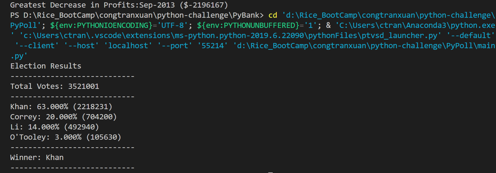

Python Homework
I. Financial Analysis

1. How to get the outcome of Financial analysis:
  - Every row represents for a month in the data, set month increased 1 unit for every row.
  - At the first row, the change is 0 and the total change is 0
  - From the 2nd row, get the change and add to the sum.
  - Find the max and min by compare with every change of the row.
  - The total and updating the last is done no matter what row.
  - Output the text file, use the list with one element in order not to separate the letter.
  
  
  
  
  
  
2. How to solve the PyPoll problem:
  - Desclare 2 lists to represent the name of candidates and the number of votes for candidates.
  - When getting the new name, add to the list of candidates and increase the according for that one's votes.
  - In the current number of candidates, if the current row is same with any index, increase the vote one unit.
  - Find the winner by comparing with the winner vote, if it is larger than winner, update the new winner.
  - Output the number of candidate and according number of votes based on the length of Candidate list.
  
  
  

  
  
3. How about the PyBoss problem?
  - Open the read file and write file at the same time
  - Define a function split_str() to split a string of letters based on "sign" that set in the parameter.
  - At row header, write a new headers for the output file.
  - From the second row, call the function split_str() to split name based on " ", split date based on "-", and split SSN based on "-".
  - Import another file where stores the dictionary of state name abbreviation.
  - Write the new row for the output file.
  
4. Regarding of the ByParagraph
  - Get the header of csv file and concatenate into a series of text.
  - Transfer the text to a list of letters.
  - Count for special sign in the list to take out when we canculate the average of letter per word.
  - Call split_str() to split word and sentence based on " " and ".".
  - Print out the analysis.
  
  
  

  

